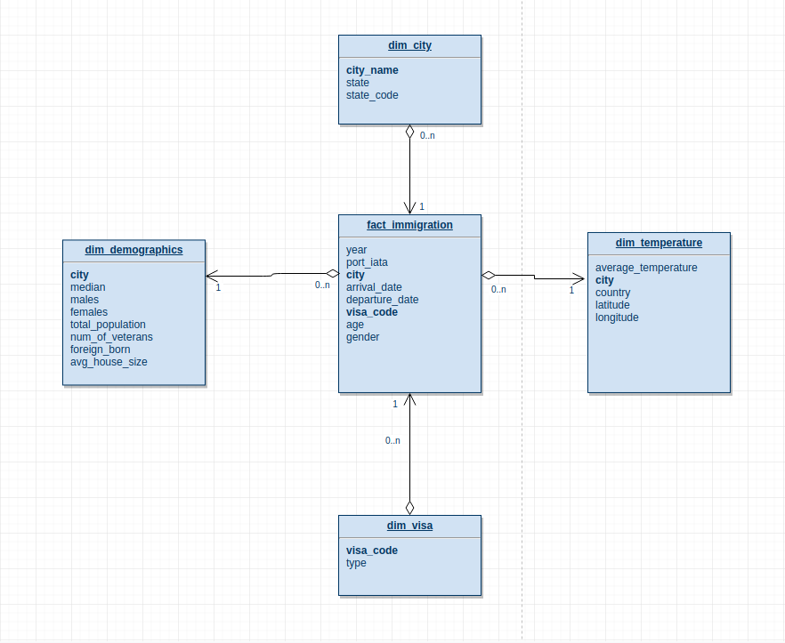

## US IMMIGRATION PATTERNS WITH RELATION TO TEMPERATURE AND CITY DEMOGRAPHICS

#### PROJECT SUMMARY

The goal of the project is to provide an organized database to aid in the studies of the US immigrations partterns.

#### Project Scope

This project will combine data from various sources which are needed for the analysis.
The data is processed using spark and are saved as parquet files on Amazon S3
which can later used in a form of schema on read.

#### Data Used for this Project

- **U.S. City Demographic Data**:  comes from OpenSoft and includes data by city, state, age, population, veteran status and race [link](https://public.opendatasoft.com/explore/dataset/us-cities-demographics/export/)
- **I94 Immigration Data**: comes from the US National Tourism and Trade Office and includes details on incoming immigrants and their ports ofentry [link](https://travel.trade.gov/research/reports/i94/historical/2016.html)
- **World Temperature Data**: from Kaggle [link](https://www.kaggle.com/berkeleyearth/climate-change-earth-surface-temperature-data)
- **Airports**: from Github [link](https://raw.githubusercontent.com/L1fescape/airport-codes/master/airports.json)

### Conceptual Data Model

The data was modeled using the star schema with:

**Fact Table**:  
 - fact_immigration
 
**Dimenstion Tables**:  
 - dim_demographics 
 - dim_city  
 - dim_temperature  
 - dim_visa  
 
### Data Quality Checks

After runing the pipeline two data quality checks are perfomed.
- Check if data  are saved to s3
- check if data table contains data

### Data Dictionary
dim_temperature
- **city**: name of city
- **average_temperature**: average temperature of the city
- **country**: country where the city belongs
- **latitude**: latitdue of the city
- **longitude**: longitude of the city

dim_demographics
- **city**: name of city
- **state**: name of city state
- **median**: median age
- **males**: male population
- **females**:  females population
- **total_population**:  total population
- **num_of_veterans**:  number of veterans
- **foreign_born**: foriegn born
- **avg_house_size**: Average family house size

dim_city
- **city**: name of city
- **state**: name of city state
- **state_code**: code of the state

fact_immigration 
- **year**: year of immigration
- **port_iata**: iata port code
- **city**: name of city
- **arrival_date**: arrival date of respondant
- **departure_date**: departure date of respondant
- **age**: age of respondant
- **visa_code**: Visa code to represent visa type Business/Pleasure/Student
- **gender**: 

dim_visa
- **visa_code**: visa code to represent visa type Business/Pleasure/Student
- **type**: visa type 

# Conclusion

The project was performed with spark as the processing tool and s3 as storage
spark was chosen because of it's ability to processing huge amount of data very fast
and s3 was chosen because of its durable data storage and the chance to use other amazon tools on the 
data if needed.

The star schema used to model the data since it's makes it easy to query the data 
and also makes thinking about the data much easier for analysts/data scientists.

The pipeline will be run as a batch job, this means it has to be requested by the analyst or data scientist,
they can suggest a periodic update if needed.

In case the data is increased by 100x the ETL pipeline script can be deployed on Amazon EMR with spark installed,
The spark workers will be configured for autoscaling if more computing power is needed.

If the data needs to be updated periodically like 7 am every morning,
a cron job can be setup to run the pipeline or if more control is needed, an automation tool like airflow can be used.

If the data needs to be read by 100 people, it will depend on the BI/dashboard tools using the data as a source.
The data is stored on s3 so any number of dashboard applications can read from it.

NOTE: Please refer to `ETL_for_US_immigration_studies.ipynb` for detailed steps and explanation of the ETL pipline